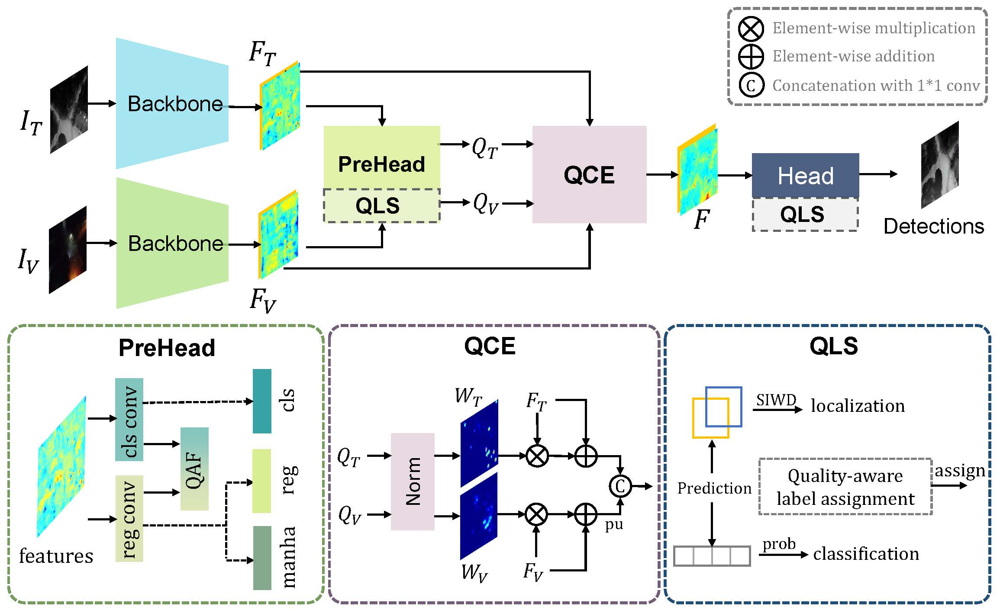

# mmdet-rgbtdroneperson
Official code for "Drone-based RGBT Tiny Person Detection".



## Installation
Please refer to <https://github.com/open-mmlab/mmdetection/tree/2.x>

## Trained Model
### On RGBTDronePerson
|Models|mAP50|mAP50(tiny)|mAP25|
|------|-----|-----|-----|
|[QFDet](https://drive.google.com/file/d/1TuVXy_h0PxTK8qLY1MgqJTNiAumV8p0V/view?usp=sharing)|42.08|44.04|57.34|
|[QFDet*](https://drive.google.com/file/d/1IkgaU5Ei88PKYZBIb0JBLv5E5kgKevrP/view?usp=drive_link)|46.72|48.75|61.62|
### On VTUAV-det
|Models|mAP|mAP50|mAP75|
|------|-----|-----|-----|
|[QFDet](https://drive.google.com/file/d/1Savf3oeiWek4eeXrvYLuaoBMoZW3nag8/view?usp=sharing)|31.10|70.40|22.90|
|[QFDet*](https://drive.google.com/file/d/1NZfd37POE0S-nMPI5RsGg1a7lN17HNvC/view?usp=sharing)|33.30|75.50|24.20|

## Train
Train QFDet on RGBTDronePerson.
```
python tools/train.py qfdet_configs/qfdet_r50_fpn_1x_rgbtdroneperson.py
```
Train QFDet* on RGBTDronePerson.
```
python tools/train.py qfdet_configs/qfdet_star_r50_fpn_1x_rgbtdroneperson.py
```
Train QFDet on VTUAV-det.
```
python tools/train.py qfdet_configs/qfdet_r50_fpn_1x_rgbtdroneperson.py
```
Train QFDet* on VTUAV-det.
```
python tools/train.py qfdet_configs/qfdet_star_r50_fpn_1x_rgbtdroneperson.py
```
## Test
For example, test checkpoint epoch_11_qfdet_rgbtdroneperson.pth:
```
python tools/test.py qfdet_configs/qfdet_r50_fpn_1x_rgbtdroneperson.py work_dir/qfdet_r50_fpn/rgbtdroneperson/epoch_11_qfdet_rgbtdroneperson.pth --eval bbox
```

## Dataset
Please refer to our [github page](https://nnnnerd.github.io/RGBTDronePerson/).

## Citation
```
.
```
